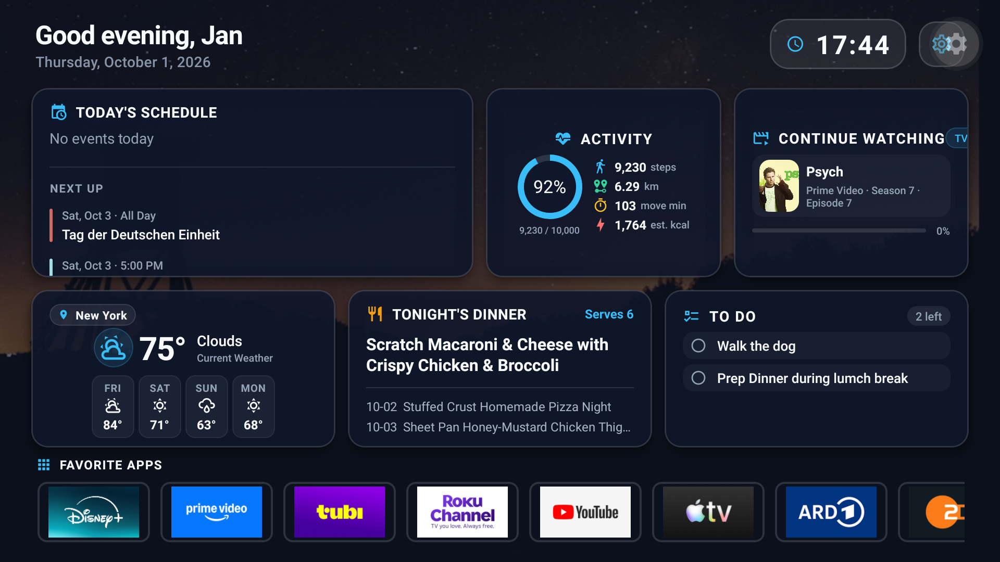

# HomeScreen — A Personal Dashboard for Smart TVs

**HomeScreen** is a personal project exploring what a Smart TV home screen could look like if it were designed around the people using it rather than advertising.

The original motivation is simple: I want a Smart TV screen that I don't mind leaving on.

Most Smart TV home screens are designed primarily as launchers for streaming services and often dedicate a significant amount of screen space to advertisements, sponsored content, and recommendations that may have little relevance to the viewer.

HomeScreen takes a different approach.

The goal is to create a calm, customizable dashboard that provides useful household information at a glance while still serving as a convenient starting point for entertainment.

> **The TV should remain useful even when nobody is actively watching it.**

---

## Current build

The repository now contains a working Android TV client, Firebase Cloud Functions, and a browser-based pairing site. The TV dashboard has schedule, tasks, activity, weather, meals, and Continue Watching cards; remote-selectable detail views; favorite apps; appearance and card controls; and an idle ambient mode. Google Calendar, Tasks, Fit, OpenWeatherMap, and an optional Google Sheet provide live data after account pairing. Continue Watching uses Android TV's Play Next row when installed apps publish titles to it. Some media in the web preview is sample data.

The companion site's `/dashboard` studio supports automatic rows and a free layout canvas: drag cards to position them, resize their corners, or enter their position and dimensions. Grid cards adapt their content to width and height: tall cards show timelines, task lists, meal details, forecasts, or activity information; small tiles keep the essentials. The companion shows saved TV photos and offers background color/opacity controls for each card. Settings → Companion site includes a permanent QR/address for returning to the editor. The linked account owner can also manage TV sessions and Google connections. All TVs on an account share one appearance configuration. These repository changes require deployment of Functions/Hosting and an updated TV app to become available to users.

Dashboard photo zoom is adjustable from 100–150% in the companion (105% by default), with a centered crop that preserves the saved image. Medium Activity cards retain the original centered-percentage ring and colored metric icons; Media shows primary and queued artwork with provider-supplied progress; short Tasks cards use compact icon rows. The favorites viewport reaches the screen edges and scrolls to keep the focused app visible.

The companion now includes responsive Weather & goals and TVs & account pages, direct Google Photos selection, full ambient preferences, and per-TV favorite app controls. Weather cities and active/default selections sync to updated TVs; lightweight photo revisions let running TVs receive replacement images. See the [UX review and settings coverage](server/pairing-web/UX_REVIEW.md). These additions require coordinated Functions/Hosting deployment and an updated TV binary.



The screenshot shows one configured TV on October 1, 2026. See the [TV app README](HomeScreen/README.md#screenshots) for the ambient screen, detail views, and settings screenshots.

| Component | Guide |
| --- | --- |
| TV app and local run instructions | [HomeScreen/README.md](HomeScreen/README.md) |
| Signed APK/AAB builds, network TV installation, and Google Play release | [HomeScreen/RELEASE.md](HomeScreen/RELEASE.md) |
| Cloud Functions and API setup | [server/functions/README.md](server/functions/README.md) |
| Pairing site and meal Sheet setup | [server/pairing-web/README.md](server/pairing-web/README.md) |

The sections below describe the product vision as well as implemented features. Family profiles, household polls, universal search, and cross-app deep links beyond supported Play Next intents remain future ideas.

---

## Project Vision

HomeScreen is intended to become a personal and household / dorm / work information dashboard designed specifically for a **10-foot TV experience**.

At a glance, the dashboard should be able to answer questions such as:

- What's happening today?
- What's on the calendar?
- What tasks still need to be completed?
- What's the weather?
- How active have I been today?
- What's for dinner?
- What were we watching?
- What should the family watch this weekend?

The interface should be simple enough to understand from across the room and easy to navigate using a standard TV remote.

---

## Design Philosophy

The project is built around a few core ideas:

- **Information at a glance**
- **No advertising**
- **User-controlled content**
- **Clear visual hierarchy**
- **Large, readable typography**
- **Simple D-pad navigation**
- **Customizable widgets and layouts**
- **Minimal interruptions**
- **Useful even when the TV is idle**

I have always appreciated software that allows users to make an interface their own — going all the way back to the customization available in the MySpace era.

HomeScreen follows that philosophy.

Rather than forcing every user into the same dashboard layout, the long-term goal is for users to decide which widgets appear, where they appear, and what information matters most to their household.

---

## Feature Ideas

The current build uses Google Calendar, Tasks, Fit, and an optional Google Sheet for several household cards. The broader set of possible widgets includes:

- **Tasks / To-Dos**
  - Google Tasks
  - Upcoming tasks
  - Completed tasks

- **Calendar**
  - Today's schedule
  - Upcoming events
  - Family calendar information

- **Health & Activity**
  - Step count
  - Daily activity goals
  - Basic fitness statistics

- **Weather**
  - Current conditions
  - Today's forecast
  - Multi-day forecast

- **Meals**
  - Today's meal
  - Weekly meal plan
  - Family meal schedule

- **Photos & Backgrounds**
  - User-selected backgrounds
  - Google Photos integration
  - Rotating screensaver / ambient images

- **Family & Community Polls**
  - Movie of the week
  - Game of the week
  - Dinner choices
  - Family activity planning
  - Roommate or community event planning

For example, a household could keep a running poll throughout the week for Friday's movie night rather than trying to make the decision when everyone finally sits down.

---

## Widget-Based Dashboard

The dashboard already supports palette and accent choices, backgrounds, layout presets, and changes to card order, visibility, and width. More customization may follow.

Each piece of information will be represented by a **widget** that provides a concise overview.

For example:

```text
┌─────────────────────┐
│ Weather             │
│                     │
│ 72°F                │
│ Clear               │
│                     │
│ H: 78°   L: 61°     │
└─────────────────────┘
```

Selecting a widget with the TV remote should open a more detailed view.

For example:

```text
Dashboard
    │
    ├── Weather
    │      └── Detailed Forecast
    │
    ├── Calendar
    │      └── Weekly / Monthly View
    │
    ├── Tasks
    │      └── Task Management
    │
    ├── Activity
    │      └── Health Details
    │
    └── Media
           └── Watch / Continue Watching
```

The Home screen should remain intentionally simple while deeper screens provide additional information and controls.

---

## Customization

Long term, users should be able to determine both the **widgets** and the **layout** of their dashboard.

Current and possible future customization options include:

- Enable or disable widgets
- Reorder widgets
- Choose widget sizes
- Select background images
- Configure data sources
- Configure profiles
- Choose which calendars appear
- Configure household polls
- Customize media sections
- Select ambient / screensaver modes

The signed-in companion site's `/dashboard` editor offers layout presets, automatic card order/visibility/width, free positioning and resizing on a bounded grid, palettes, accent, background choice, and per-card surface color/opacity. Saved TV Photos can be viewed there, including a larger image view and background preview. Save to TV applies appearance changes; stale saves are rejected if another device changed the settings. Cards adapt the amount of information they show and still open their detail view. The studio also autosaves account drafts, supports session Undo/Redo, stores named designs, and restores published revisions into a draft. Save to TV remains the publish action. Additional widgets, typography/spacing controls, and further design tokens remain future work. See the [companion roadmap](server/pairing-web/COMPANION_ROADMAP.md) and [layout contract](server/pairing-web/DASHBOARD_LAYOUT.md).

---

## Profiles

HomeScreen may eventually support multiple household profiles.

Each profile could have its own:

- Calendar
- Tasks
- Activity information
- Watchlist
- Continue Watching history
- Favorite widgets
- Dashboard layout
- Background preferences

The TV could then switch between personal dashboards while still supporting shared household information.

---

## Media Integration

A long-term goal is to make HomeScreen useful as an entertainment launcher without turning it into another advertising-driven recommendation screen.

Potential media features include:

- Continue Watching
- Recently Watched
- Personal Watchlist
- Favorite movies and shows
- Music shortcuts
- Family movie polls
- User-controlled recommendations

The goal is not to recreate Netflix, Disney+, Spotify, or other media services.

Instead, HomeScreen could act as a **personal media hub** that helps users return to content they have already chosen.

---

## Cross-App Deep Linking

One of the project's more ambitious goals is to launch content directly in installed streaming applications.

For example:

```text
HomeScreen
     │
     ▼
Continue Watching
     │
     ▼
"The Bear"
     │
     ▼
Streaming App
     │
     ▼
Episode
```

Where supported by the platform and streaming provider, cross-app deep linking could allow HomeScreen to launch movies, shows, music, or other media directly in the appropriate application.

This would allow HomeScreen to function as an alternative starting point to the default Smart TV launcher.

---

# Architecture

The current architecture uses a React Native TV client, Firebase Authentication, Cloud Functions, Firestore, and a small browser pairing site.

```text
Android TV app ── authenticated requests ──► Cloud Functions ──► Google APIs / weather
       │                                           │
       │                                           └─────────────► Firestore
       │                                                              ▲
       └── pairing code / QR ──► Pairing site ──► OAuth callback ──────┘
```

The architecture is designed around one important TV-specific requirement:

> **The dashboard should feel immediate when the TV turns on.**

The backend writes dashboard summaries to Firestore. The TV requests the summary endpoint, which serves a recent cache when available and refreshes connected services when the cache expires.

---

## Cloud Functions

### `getDashboardSummary`

**Authenticated HTTP GET — Dashboard Reader**

Fetches Calendar, Tasks, Fit, weather, and optional meal information for the signed-in user and returns a dashboard JSON payload. The handler uses `Promise.allSettled()` so an upstream failure can leave other cards available.

Current response data includes Calendar events, Tasks, Fit activity, weather, and optional meals. Future data could include:

- Polls
- Widget configuration

The current backend queries these services in parallel.

For example:

```text
Weather API ──────── ✓
Calendar API ─────── ✓
Tasks API ────────── ✕
Activity API ─────── ✓

                    │
                    ▼

Dashboard still renders available data.
```

The endpoint reads a ten-minute Firestore cache before calling upstream services. On a miss, it writes the new summary before returning it.

---

### `authDevice`

**HTTP POST — TV Authentication & Pairing Manager**

Issues a six-character TV code and a private poll secret. The companion site handles Google sign-in and consent; the TV receives a one-time custom token after the matching code is approved.

Typing usernames, passwords, and authorization information using a TV remote is a poor user experience, so authentication should be designed around a TV-friendly pairing process.

A typical flow could look like:

```text
TV
 │
 ▼
Display QR / Pairing Code
 │
 ▼
Phone or Computer
 │
 ▼
User Authorizes Account
 │
 ▼
Backend Receives Authorization
 │
 ▼
TV Becomes Connected
```

The backend is responsible for securely associating authorization credentials with the appropriate user or device.

Any long-lived credentials or refresh tokens should be encrypted and never stored directly on the TV client.

---

### `executeAction`

**Authenticated HTTP POST — Remote-Control Interactions**

Handles actions initiated from the TV interface.

Examples include:

```text
completeTask
updatePreferences
```

Possible actions:

- Mark a task as complete
- Update a dashboard preference

Keeping these operations behind a consistent action API allows TV components to remain relatively simple.

---

### `syncUserData`

**Authenticated HTTP POST — On-Demand Synchronization**

Refreshes connected-service data and writes a dashboard cache when called. There is no scheduled trigger in the current code.

Possible synchronized data includes:

- Calendar events
- Tasks
- Activity metrics
- Weather
- Household information

The updated data is written to Firestore and can be read by the TV summary endpoint.

```text
External Services
       │
       ▼
syncUserData (on demand)
       │
       ▼
   Firestore
       │
       ▼
getDashboardSummary
       │
       ▼
      TV
```

The TV requests a dashboard refresh every five minutes; the summary endpoint serves its ten-minute cache when it is fresh.

---

## Performance Philosophy

A television dashboard should not behave like a traditional web page that displays several loading spinners while waiting for independent API requests.

The longer-term performance target is:

```text
Synchronize → Cache → Display → Refresh
```

rather than:

```text
Open App → Call APIs → Wait → Wait → Wait → Display
```

The summary request fetches upstream data when its cache expires, and the TV retains its last successful snapshot during a temporary request failure.

---

## Target Platform

HomeScreen is being designed primarily for:

- Smart TVs
- Android TV
- Google TV
- TV-focused React Native applications

The primary design target is:

**3840 × 2160 (4K UHD)**

The interface should remain resolution-independent so that it can scale appropriately to other common TV resolutions, including **1920 × 1080**.

The design assumes a typical **10-foot viewing distance**, meaning controls and information must remain understandable from across a room.

---

## Technology

The project currently explores technologies including:

```text
React Native
React Native TV
TypeScript
Firebase
Firestore
Cloud Functions
Google APIs
OAuth 2.0
```

Additional services and APIs will likely be introduced as individual widgets are developed.

---

# Current Features and Future Ideas

HomeScreen is intentionally an experimental project, so the feature set may evolve considerably.

Current features and future directions include:

### Ambient Mode (implemented)

The dashboard now enters Ambient Mode after 10 minutes without remote input by default. In Settings → Ambient, you can turn it off, change the delay, choose rotating built-in photos, select up to eight Google Photos for a personal slideshow, use a color-customizable plasma flow, or use a dark backdrop. The clock and date remain visible while selected weather, calendar, activity, task, and meal details rotate. A preview button starts the mode immediately, and a navigation button restores the dashboard.

To choose personal photos, open Settings → Ambient → Google Photos and scan the QR code with your phone. Select up to eight photos and tap Done. The selection replaces the previous ambient photo set. Choosing photos from Settings → Background also uses the first selected photo as the dashboard background. Ambient Mode is not a substitute for the TV's own panel protection or powering the TV off when it is not needed.

If Google Photos says it cannot open a picker link, use **New QR code** on the TV and scan that code. The phone's browser must be signed into the Google account connected to the dashboard; if the Photos app opens to a different account or cannot open the link, use Chrome with the connected account. Picker links are single-use and expire. The photo selection and fresh-session behavior require the current Firebase Functions to be deployed to the API URL used by the TV app.

Future ambient content could include artwork, astronomy imagery, and more household information.

### Smart Home

Possible future integrations include:

- Lights
- Thermostats
- Door sensors
- Garage status
- Cameras
- Home Assistant

### Companion Site

The pairing site now includes a phone-friendly layout canvas, appearance controls, account connection status, and linked TV management. Future companion features could make it easier to:

- Configure dashboards
- Reorder widgets
- Manage profiles
- Create polls
- Select backgrounds
- Connect services
- Configure media shortcuts

### Universal Search

A future search system could allow queries such as:

```text
What's happening tomorrow?

What's the weather this weekend?

What movie did we vote for?

What tasks do I still have?

What was I watching last night?
```

---

# Long-Term Goal

The larger idea behind HomeScreen is not simply to build another Smart TV launcher.

It is to explore what a television home screen could become if it were treated as a **personal household dashboard**.

A TV occupies one of the largest and most visible screens in many homes. Even when nobody is watching a movie or television show, that screen could still provide useful information.

HomeScreen aims to make that space:

**Personal. Useful. Calm. Customizable. Ad-free.**

The TV should work for the household — not the advertisers.
