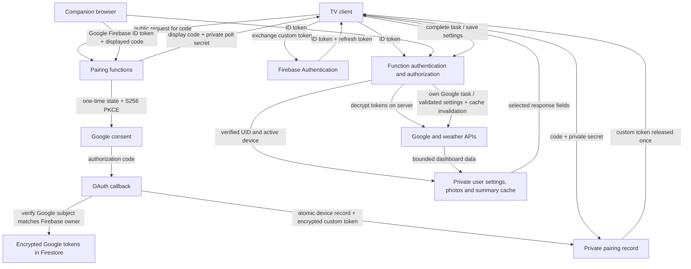

# Public-release security review — October 5, 2026

**Decision: hold public release.** The database access model is sound, and several
concrete application flaws have been fixed in this working tree. Production still
has excessive runtime permissions, the existing APK has a debug signature, and
abuse controls and dependency exposure need release evidence. The source fixes
have not been deployed, and the APK has not been rebuilt.

This is a source-assisted security assessment with adversarial unit tests and
read-only production checks. It is not a full penetration-test certification or
an assertion of compliance with every industry-standard requirement.

## Scope and evidence

Starting revision: `760feb4`. Reviewed all 17 exported functions, authentication,
pairing and OAuth, Firestore helpers and rules, Google service clients, photo
downloads, companion rendering and API transport, TV authentication/persistence,
dashboard state, and Android release configuration.

Assets considered: Google access/refresh tokens; Firebase sessions and pairing
secrets; calendar, task, activity and meal information; location preferences;
personal photos; app inventory; and control over cloud resources and costs.
Threats considered include unauthenticated callers, another signed-in account,
a copied TV credential, replay and concurrent requests, untrusted provider
responses, and the blast radius of a compromised function.

The review uses [OWASP API Security Top 10](https://api-security.owasp.org/editions/2023/en/0x11-t10/),
[OWASP ASVS 5.0](https://github.com/OWASP/ASVS/tree/v5.0.0), and
[OAuth Security BCP / RFC 9700](https://www.rfc-editor.org/rfc/rfc9700.html)
as reference frameworks. ASVS Level 2 is a suitable verification target for this
personal-data application; this review samples relevant controls rather than
claiming completion of its entire requirement set.

Supporting artifacts:

- [Dependency audit snapshot](security-review/2026-10-05/dependency-audit.json)
- [Cloud and APK verification](security-review/2026-10-05/cloud-verification.json)
- [Low-volume deployed authorization smoke check](security-review/2026-10-05/production-auth-smoke.cjs)
- [Deployed authorization results: 15/15 denied](security-review/2026-10-05/production-auth-results.json)
- [Security lifecycle regression tests](functions/test/securityLifecycle.test.js)

## Database → TV → server data flow

The TV does not directly access Firestore. Every user-data path is derived from
the UID in a server-verified Firebase ID token. A managed TV must also present a
server-issued device claim whose record exists and is not revoked. Firebase
revocation checks run on authenticated requests. Google browser owners have
additional account and device-management capabilities.

| Data / operation | Storage or destination | Boundary and limits |
|---|---|---|
| Google credentials | Encrypted fields under `users/{uid}` | AES-256-GCM; decrypted on the server; excluded from client response DTOs |
| Firebase TV refresh token | Expo SecureStore | Existing unencrypted Auth persistence is migrated and removed; failure does not fall back to plaintext |
| Displayed pairing code | `device_codes` | 15-minute application expiry; separate 256-bit poll secret is required to obtain the custom token |
| OAuth state and verifier | `oauth_states` | Hashed state key, 10-minute expiry, one-time transaction, PKCE, matching Google subject and revocation version/cutoff |
| Dashboard cache | `users/{uid}/cache/dashboard` | Ten-minute serving freshness; seven-day storage TTL; provider counts and 750 KB cache limit |
| Selected photos | Private appearance documents | Up to eight images, 550 KB per image, bounded streaming, raster MIME allowlist, authenticated reads |
| Settings and designs | Private user documents | Field/value validation, body-size checks, and revision transactions |
| Installed TV apps | Own device's settings document | TV reports inventory; owner may edit preferences; no icon upload; bounded inventory |
| Task completion | Owner's Google Tasks API | TV supplies task IDs; server uses that verified user's Google credentials and invalidates the summary cache |
| Weather | Shared weather cache and provider | Fixed provider endpoint, encoded city query, per-user lookup quotas; shared cache has no UID |

TVs are trusted to see and modify account-wide dashboard data. There are no
household roles or a read-only TV permission level. That is a product access model
to document explicitly, rather than an isolation guarantee between household TVs.

## Findings fixed in source

| ID | Severity | Original behavior and impact | Implemented change |
|---|---|---|---|
| APP-01 | High | A legacy custom-token session had no device record check and could POST arbitrary installation keys to mint new device identities. Removing one TV did not constrain a copied legacy credential. | Reject unmanaged and unexpected providers; remove installation-key token minting; require owner-approved pairing again. |
| APP-02 | High | A TV could start pairing another TV using the shared UID-level authentication helper. This exceeded the browser owner's intended authority. | `beginGoogleLink` now requires a verified Google browser owner. |
| APP-03 | High | An unfinished OAuth callback could restore credentials after disconnect/sign-out. Checking that the Google subject still matched a Firebase profile did not establish that consent was still authorized. | Commit-time authorization version and session cutoff; account controls invalidate pending flows, including exchanges already in progress. Disabled accounts are rejected. |
| APP-04 | High | A summary fetch, photo download or settings write could finish after cleanup and restore private data. Firestore recursive deletion does not lock out other writers. | Credential, cache, photo and Sheet commits check the revocation version; settings and device-app transactions check a deletion tombstone. Auth is disabled before account removal. |
| APP-05 | Medium | Production clients accepted HTTP API configuration and the TV defaulted to cleartext localhost when configuration was missing. | Production requires HTTPS, with local HTTP allowed only in development. Reject URL credentials/query/fragment. Browser and server photo fetches refuse redirects. Native redirect behavior still requires APK-level validation. |
| APP-06 | Medium | Deleting an account accepted an arbitrarily old owner session. A refreshed ID token could still belong to an old sign-in. | Require Firebase `auth_time` within five minutes; refreshing a token does not reset that age. |
| APP-07 | Medium | Several expensive provider operations and public pairing polls had no application quota. Concurrent cache misses could fan out to multiple Google calls. | Quotas for polls, consent, photo sessions, Sheet validation, task actions and summary misses. Existing weather and forced-sync quotas remain. Edge protection is still needed. |
| APP-08 | Low | Photo fetches checked the first URL but followed redirects; provider exceptions were returned verbatim. | Reject unexpected ports/credentials and redirects; return a generic provider error. The URL comes from Google, so this is defense in depth rather than a demonstrated user-controlled SSRF exploit. |
| APP-09 | Medium | A late API response could sign out a replacement account or supply old-account data. Dashboard state could survive a direct UID change. | Reject responses when the requesting account changed; remount the dashboard on UID changes. |

Security headers have also been added for Hosting and the OAuth callback. The
companion CSP is deliberately **report-only** until real Firebase/Google redirect
sign-in has been tested against its source allowlist. It currently provides no
CSP enforcement. Hosting's other configured headers still require deployment.

The new `account_security/{uid}` barrier contains only a version, deletion flag,
update time and session revocation cutoff. It survives account deletion to prevent
late writes from recreating data. It contains no tokens, images, calendar or
activity content. Its retention must be documented; it must not be removed during
the ordinary user-data cleanup. A partially failed deletion leaves Auth disabled
and requires an administrative cleanup retry.

## Remaining release blockers

### CLOUD-01 — High: runtime has project Editor permissions

Live inspection confirms that all 17 functions use
`488478409476-compute@developer.gserviceaccount.com`, which has unconditional
`roles/editor` on `tv-homescreen-backend`. This gives a compromised runtime far
more project access than the application needs. Firestore deny rules do not
constrain this service account's Admin SDK access.

Move functions to dedicated runtime identities and separate build/deploy access.
Use only the required Firestore access, Firebase Auth lookup permissions for
ordinary endpoints, Auth update/delete permissions for account controls, secret
access on the particular secrets each function uses, and scoped signing access
for the pairing callback. Prefer a custom role for `iam.serviceAccounts.signBlob`
where appropriate; do not grant project-wide Token Creator. Evaluate existing
uses of the default identity before removing its Editor binding. Test the new
identities in staging and use IAM Policy Simulator before changing production.
[Google's service-account guidance](https://docs.cloud.google.com/iam/docs/best-practices-service-accounts)
supports this separation and least-privilege approach.

### RELEASE-01 — High: existing release APK has a debug signature

The generated `build.gradle` explicitly assigns `signingConfigs.debug` to the
release variant. `apksigner verify --print-certs` confirms the existing
`app-release.apk` certificate is `CN=Android Debug`.

The tracked release script now rejects that known configuration unless
`-AllowDebugSigning` is explicitly selected for internal testing. This guard is
not a production signing implementation and cannot secure the existing APK.
Provision an upload/release key through a secure build pipeline or Play App
Signing; rebuild and verify the actual artifact's certificate, merged manifest,
network policy, debug/dev-client components and bundled API URL. Direct Gradle
builds can bypass the script guard and must also be checked by the release pipeline.
[Android's release-signing guidance](https://developer.android.com/studio/publish/app-signing)
describes the production signing requirements.

### ABUSE-01 — Medium: public ingress and cost controls need deployment evidence

All deployed functions allow public ingress and have 60-second timeouts. Four
functions have five-instance limits; the others have ten. Public ingress is
expected for these HTTP APIs, but it is not evidence of rate limiting. A maximum
instance count limits concurrency, not total billable requests, rejected quota
reads, Firestore writes, or provider calls.

Put appropriate abuse controls in front of unauthenticated pairing and authenticated
provider operations. Verify the caller-IP behavior behind the deployed proxy and
prevent callers from bypassing an edge policy through raw function/service URLs.
Evaluate App Check where supported by the browser and TV builds. Confirm billing
alerts, authentication quotas, provider quotas and alert delivery. Test application
quota behavior under concurrent requests in the emulator/staging environment.

### DEP-01 — advisory severity High/Moderate: dependency exposure remains unresolved

The current `npm audit --omit=dev` results are:

| Tree | High affected packages | Moderate affected packages | Critical |
|---|---:|---:|---:|
| Functions | 0 | 8 | 0 |
| Companion | 4 | 0 | 0 |
| TV | 19 | 7 | 0 |

These counts include dependency chains affected by the same underlying advisory.
They do not mean 38 independent vulnerabilities or 38 remotely exploitable paths.
`--omit=dev` still reports Expo build tooling because it is reached from production
package dependencies.

Underlying advisories include
[`@grpc/grpc-js` certificate validation](https://github.com/advisories/GHSA-m9gg-hp2v-232j),
[`node-forge` signature validation](https://github.com/advisories/GHSA-86w9-cpqp-85rv),
[`braces` stack exhaustion](https://github.com/advisories/GHSA-vfj7-8cjw-p6xm), and
[`uuid` buffer bounds](https://github.com/advisories/GHSA-w5hq-g745-h8pq).
The built companion JS has no `@grpc/grpc-js`, `getAuthContext`, or `node-forge`
signatures, and its source imports Firebase App/Auth rather than Firestore. This
reduces apparent browser exposure but is not a complete reachability analysis.
Expo/Metro/tooling advisories affect the build environment even when absent from
the distributed TV runtime.

Upgrade affected packages using compatible patched versions and validate the
Firebase/Expo/TV combination. Where a patch is unavailable or a package is absent
from shipped code, record the actual path, exposure evidence, mitigations, owner
and review date. Do not apply audit's suggested major downgrades/`--force` as a
substitute for compatibility testing. No dependencies were changed in this review.

## Production checks and validation

Read-only checks confirmed:

- The live default Firestore rules match the repository's unconditional client
  read/write denial.
- All eight `deleteAt` TTL policies are ACTIVE: `appearance`, `cache`,
  `code_request_limits`, `device_codes`, `oauth_states`, `pair_attempts`,
  `user_request_limits`, and `weather_cache`.
- The 17 deployed functions are ACTIVE on Node.js 22 in `us-central1`.
- The existing APK's signature verifies, but its certificate is the debug certificate.
- A low-volume anonymous check of all 15 protected HTTP endpoints returned `401`;
  final results are stored alongside the review. This is a baseline check of the
  deployed version, not a test of the new source fixes.

Local validation: backend build and 89 tests passed; backend lint passed; TV
typecheck and 16 tests passed; companion typecheck/production build passed;
PowerShell parsed the release script without errors; `git diff --check` passed.
Security tests cover encryption authentication, secret-required one-time pairing,
expired/replayed OAuth state, owner restrictions, revocation/version races,
late cache/settings commits, account disconnect behavior, deletion reauthentication,
photo origin/redirect/MIME restrictions, quotas and stale TV responses.

Unit tests use an atomic Firestore fixture and mocked Auth/provider calls. They
do not prove actual Firestore transaction contention, IAM enforcement, Google
consent, native SecureStore behavior or Android networking. Real pairing,
per-TV revocation, incremental consent, Photos selection and partial cleanup
failure must still pass integration tests using disposable accounts and devices.

## Additional operational and privacy checks

Live database deletion protection and point-in-time recovery are disabled. That
is an availability/recovery gap, not proof of public database exposure. Enable
appropriate safeguards after reviewing storage cost and retention requirements,
and test restoration. Establish how deletion requests affect backups and logs.

Confirm encryption-key entropy (at least 32 cryptographically random bytes),
secret access controls and rotation procedures without placing keys in code or
client environment variables. The current token format has no key-version or
per-user associated-data field; plan a migration for rotation and consider
binding ciphertext to its owner/field. Secret values were not retrieved in this
assessment. The working tree tracks an environment example but no actual `.env`
file; this is not a full Git-history or external credential-leak scan.

Restrict CORS to the configured companion origins as hardening; CORS itself is
not authentication and does not stop native clients. Test and enforce the CSP.
Review Android backup rules, exported components, surplus storage/overlay
permissions and third-party Watch Next intents/poster URIs in the merged release
artifact. Those local integrations are a different trust boundary from Firestore.

Define a privacy policy for calendar/activity data, photos, location, app inventory,
logs, backups and the security tombstone. An offline TV can keep its last displayed
snapshot until it reconnects or the app restarts; remote revocation cannot erase an
offline screen. Choose and document an offline-data expiration policy. Confirm
Google consent verification, requested scopes and applicable platform data-use
requirements for the production OAuth project.

## Release sequence

1. Resolve runtime IAM and production signing, and record dependency remediation
   or justified exposure decisions. Establish edge protections and alerts.
2. Deploy this source to staging; re-pair legacy TVs. Pending pre-update OAuth
   states intentionally fail closed and need to be restarted.
3. Exercise two different accounts and multiple TVs: forged UID/device IDs,
   revoked/expired tokens, pairing replay, concurrent disconnect/deletion and
   provider fetches, Photos downloads, stale settings and quota exhaustion.
4. Run real Google sign-in/consent and account cleanup with disposable data;
   verify no credentials/private content are returned or logged. Enforce the
   validated browser policy and verify the signed APK on a TV.
5. Deploy reviewed functions and Hosting changes; repeat authorization, IAM,
   rules, TTL and monitoring checks. Preserve this report's deployment evidence
   separately from source-test evidence before approving public release.

No function, Hosting, IAM, database protection or secret changes were applied to
production during this review.
